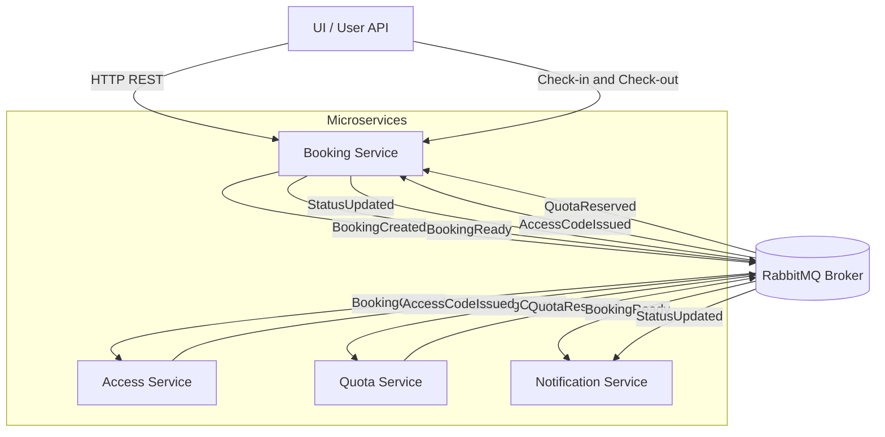

# 🎧 TP2 — Microservices : Podcast Booking System

Ce projet illustre une architecture **microservices événementielle** construite autour d’un système de réservation de studio d’enregistrement de podcast.  
Chaque service est indépendant et communique via **RabbitMQ** à travers des **événements asynchrones**.

---

## 🧩 Architecture générale

### 🗺️ Diagramme global


### 🧠 Description des composants

| Service | Rôle |
|----------|------|
| **User API / UI** | Interface (via navigateur ou cURL) permettant de créer et gérer les réservations. |
| **Booking Service** | Service central qui orchestre la création, la validation et le suivi des réservations. |
| **Access Service** | Génère et valide les codes d’accès aux studios. |
| **Quota Service** | Réserve les créneaux horaires disponibles pour les studios. |
| **Notification Service** | Envoie les confirmations et notifications. |
| **RabbitMQ** | Message broker gérant les communications asynchrones entre microservices. |


👉 Si un utilisateur dépasse son quota sa réservation est automatiquement annulée.    


---

## ⚙️ Technologies utilisées

- **Python 3.11**
- **FastAPI** (pour les APIs REST)
- **SQLModel** (pour la persistance des données)
- **RabbitMQ** (communication interservices)
- **HTMX + Jinja2** (pour l’interface web)
- **Docker Compose** (orchestration des services)

---

## 🚀 Étape 1 : Cloner le projet

```bash
git clone https://github.com/doctorpest/TP2_Microservices_Architecture.git
cd TP2_Microservices_Architecture

```
Ou bien juste télécharger le zip. 

---

## 🐳 Étape 2 : Lancer l’infrastructure Docker

```bash
docker compose up --build

```

On vérifie que les services suivants démarrent correctement : 

- **booking**
- **access**
- **quota**
- **notification**
- **rabbitmq**

RabbitMQ est accessible à :
👉 http://localhost:15672
(user: guest, password: guest)

---

## 🧪 Étape 3 : Tester les endpoints REST

### Créer une réservation

```bash
curl -X POST http://localhost:8000/v1/bookings \
  -H "Content-Type: application/json" \
  -d '{"user_id":7,"studio_id":1,"start":"2025-11-10T17:00:00","end":"2025-11-10T18:00:00"}'

```

### ➡️ Réponse attendue 

```bash
{
  "id": 10,
  "user_id": 7,
  "studio_id": 1,
  "status": "PENDING",
  "created_at": "2025-11-08T21:53:10.165831-05:00"
}

```

### Consulter la réservation

```bash
{
  "id": 10,
  "user_id": 7,
  "studio_id": 1,
  "status": "READY",
  "code": "707684",
  "quota_reservation_id": "7"
}

```

### Check-in avec le code d’accès

Faut récupérer le code généré ainsi que l'id de l'utilisateur à partir de la consultation de la réservation qu'on a fait juste auparavant. Faut faire attention le chekin ne passe pas si la date et heure du début de la réservation n'est pas encore arrivé.    

```bash
curl -X POST "http://localhost:8000/v1/bookings/10/checkin?code=707684"

```

### ➡️ Réponse attendue dans le cas où c'est l'heure de la réservation   

```bash
 {"detail": "IN_USE"}"

```


---

## 💻 Étape 4 : Tester via l’interface utilisateur

Ouvrez le navigateur sur    

```bash
 http://localhost:8000/ui

```

On pourra par la suite :    
- Créer une réservation
- Voir le statut en temps réel (PENDING, READY, IN_USE, etc.).
- Faire un **check-in/check-out** directement après l'interface.
- Accéder directement à la documentation des API utilisées.    

L’UI est développée avec HTMX + Jinja2, rendant l’expérience fluide et réactive.    

👉 Pour que les changements prennent place faut actualiser la page après chaque modification pour pouvoir les changements.


---

## 📨 Étape 5 : Communication interservices (RabbitMQ)    

| Événement        | Producteur | Consommateur | Description                                                   |
|------------------|-------------|---------------|----------------------------------------------------------------|
| BookingCreated   | Booking     | Access, Quota | Déclenche la réservation de quota et la génération du code d’accès |
| QuotaReserved    | Quota       | Booking       | Informe que la réservation du créneau est réussie              |
| AccessCodeIssued | Access      | Booking       | Informe que le code d’accès a été généré                      |
| BookingReady     | Booking     | Notification  | Informe que la réservation est complète                       |
| StatusUpdated    | Booking     | Notification  | Informe d’un changement d’état (check-in/out)                 |


---

## 📘 Exemple de flux complet    

1. L’utilisateur crée une réservation via `/ui` ou `/v1/bookings`.
2. **Booking** publie `BookingCreated` sur **RabbitMQ**.
3. **Access** et **Quota** consomment cet événement, génèrent le code et réservent la plage horaire.
4. **Booking** reçoit `AccessCodeIssued` et `QuotaReserved` → statut **READY**.
5. **Notification** informe l’utilisateur.
6. L’utilisateur se présente → **check-in** → **Booking** envoie `StatusUpdated`.


---

## 📄 Auteur

Ayat Allah EL Anouar, Elmamoune Mikou

---

## 🧠 Ressources utiles

- [FastAPI Documentation](https://fastapi.tiangolo.com/)
- [RabbitMQ Tutorials](https://www.rabbitmq.com/getstarted.html)
- [Docker Compose](https://docs.docker.com/compose/)
- [HTMX](https://htmx.org/)   


